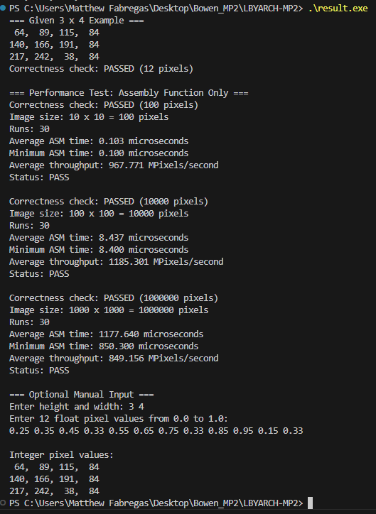

# LBYARCH MP2
## Float Grayscale to uint8 Conversion Using C and x86-64 Assembly

---

Member : Li, Bowen | Fabregas, Matthew Drew

# Project Description

This project converts a grayscale image represented using single precision floating-point values (0.0 to 1.0) into unsigned 8-bit integer grayscale values (0 to 255).

The conversion is implemented using:

- C (main program)
- x86-64 Assembly (NASM)

The C program is responsible for:

- Reading user input
- Allocating memory
- Calling the assembly function
- Printing the output
- Correctness checking
- Performance testing

The x86-64 assembly function is responsible for converting every floating-point pixel into an unsigned 8-bit integer.

---

# Formula

```
Integer Pixel = round(Float Pixel × 255)
```

Example

| Float | Integer |
|-------|---------|
|0.00|0|
|0.25|64|
|0.50|128|
|0.75|191|
|1.00|255|

---

# Files

```
main.c
img_convert_win64.asm
README.md
result.exe
result.png
```

---

# Software Used

- MSYS2 UCRT64
- GCC
- NASM

---

# How to Compile

Download MSYS2

Open **MSYS2 UCRT64**

Go to the project directory.

Example

```bash
cd "/c/Users/User/OneDrive/Desktop/LBYARCH Mp2"
```

Assemble the assembly source

```bash
nasm -f win64 img_convert_win64.asm -o img_convert_win64.obj
```

Compile and link

```bash
gcc -O2 -Wall -Wextra -std=c11 main.c img_convert_win64.obj -o result.exe
```

---

# How to Run

Inside MSYS2

```bash
./result.exe
```

or inside Windows Command Prompt

```cmd
result.exe
```

---

# Example Input

```
3 4

0.25 0.35 0.45 0.33
0.55 0.65 0.75 0.33
0.85 0.95 0.15 0.33
```

---

# Example Output

```
64 89 115 84
140 166 191 84
217 242 38 84
```

---

# Correctness Check

The program compares the assembly output with the C reference implementation.

If every pixel matches, the program displays

```
Correctness check: PASSED
```

---

# Performance Test

The assembly function is timed only.

The following image sizes are tested.

- 10 × 10
- 100 × 100
- 1000 × 1000

Each size is executed 30 times.

The average execution time is reported.

---

# Scalar SIMD Instructions Used

The assembly implementation uses scalar SIMD instructions.

- MOVSS
- MULSS
- ADDSS
- MAXSS
- MINSS
- CVTTSS2SI

Registers used

- XMM0
- XMM1

---

# Performance Results

This section details the benchmark results of the x86-64 assembly conversion function. The performance was tested across three different image resolutions (10x10, 100x100, and 1000x1000). To ensure statistical reliability and account for timer overhead, each image size was processed for 30 consecutive runs. The table below summarizes the average execution time, minimum execution time, overall throughput, and the correctness status.

| Image Size | Avg ASM Time (μs) | Min ASM Time (μs) | Avg Throughput (MP/s) | Status |
|------------|-------------------|-------------------|-----------------------|--------|
| 10 × 10 | 0.103 | 0.100 | 967.771 | PASS |
| 100 × 100 | 15.057 | 8.400 | 664.158 | PASS |
| 1000 × 1000 | 1704.900 | 1034.000 | 586.545 | PASS |

### Output Screenshot



---

# Performance Analysis

The execution time increases as the image size increases because the assembly function processes one pixel at a time using scalar SIMD instructions.

The 10 × 10 image finishes very quickly, so timer overhead has a larger effect.

The 1000 × 1000 image provides a more stable timing result because it performs one million pixel conversions.

---


---

# Video

()

